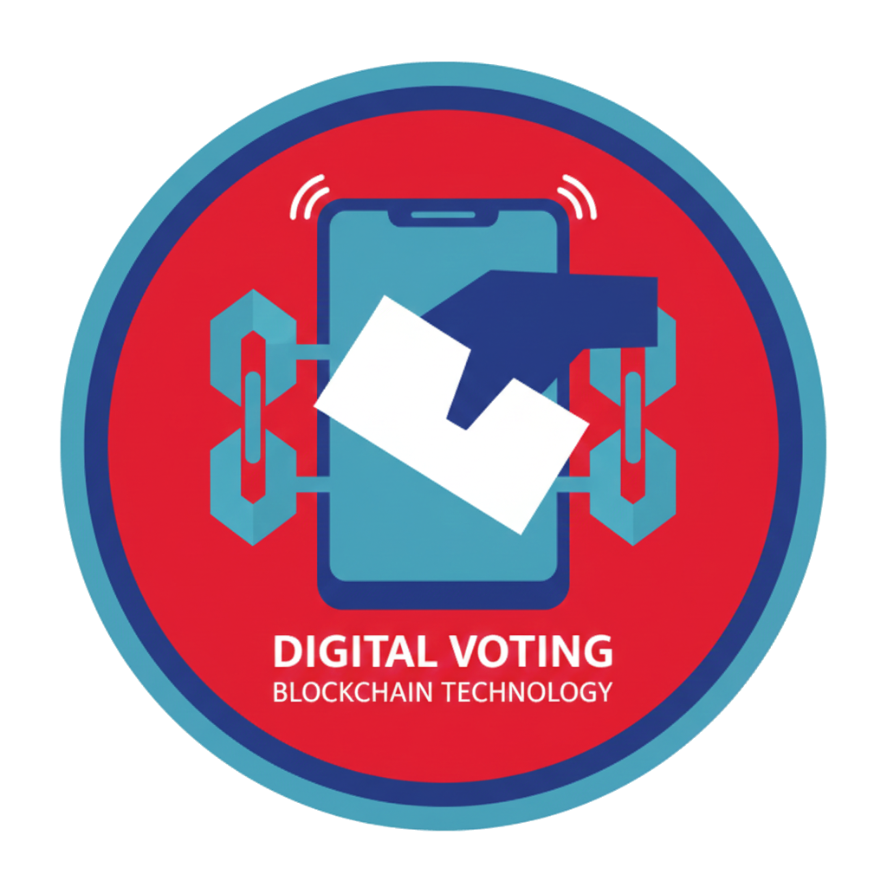
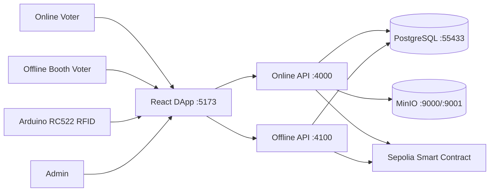
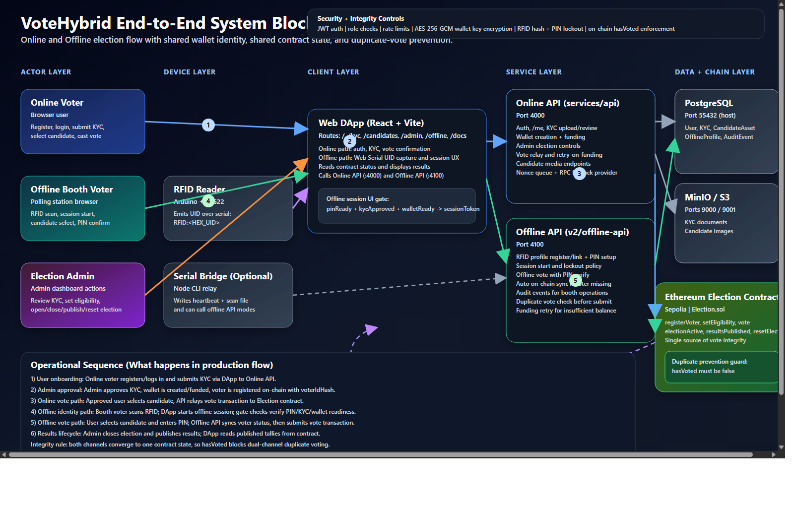

# VoteHybrid

<p align="center">
  
</p>

<p align="center">
  <strong>A hybrid blockchain voting platform with online voting, RFID-assisted offline voting, and on-chain integrity checks.</strong>
</p>

<p align="center">
  
  
  
  
</p>

## Demo Video

Watch the latest short project demo here:

- [Open `short.mp4`](https://github.com/ashutoshshah1/voting-system-master/releases/download/docs-short-video-2026-03-30/short.mp4)
- [View the GitHub release](https://github.com/ashutoshshah1/voting-system-master/releases/tag/docs-short-video-2026-03-30)

---

## What This Project Does

VoteHybrid combines two voting modes in one system:

- Online voting through a React web application and Express API
- Offline booth voting using RFID scan + PIN confirmation
- Shared voter state across both modes
- Final vote protection enforced on-chain to prevent duplicate voting

This means a voter can be verified online or at a local booth, but the system still converges on one source of truth for eligibility and whether that voter has already voted.

## Highlights

- Modern full-stack architecture with React, Vite, Express, Prisma, PostgreSQL, and MinIO
- Smart contract-backed election state using Solidity and Foundry
- Offline booth flow with Arduino RC522 RFID scanning
- Browser Web Serial support for direct booth operation
- Optional Node serial bridge for diagnostics and local bridge-based scanning
- Shared online/offline anti-double-vote protections
- Admin workflows for KYC review, voter readiness, and election control

## Architecture At A Glance



<p align="center">
  
</p>

## Repository Layout

```text
.
|- apps/dapp                 React frontend for voters, admins, and /offline booth
|- services/api              Online API for auth, KYC, admin, and online voting
|- v2/services/offline-api   Offline API for RFID session + PIN voting flow
|- v2/device/arduino         Arduino RC522 sketch
|- v2/device/serial-bridge   Optional Node serial bridge for diagnostics
|- contracts                 Solidity contract + Foundry tests
|- docs                      Architecture, workflow, and project documentation
|- docker-compose.yml        Local PostgreSQL + MinIO
|- setup.ps1 / setup.sh      One-time setup scripts
|- start.ps1                 Start local services on Windows
```

## Tech Stack

| Layer | Stack |
| --- | --- |
| Frontend | React 19, Vite 7, TypeScript 5.9, React Router 7, Tailwind CSS, ethers 6 |
| Online API | Node.js, Express 5, Prisma 6, Zod 4, JWT, Multer, AWS SDK S3 |
| Offline API | Node.js, Express 5, Prisma 6, Zod 4, JWT, bcryptjs, ethers 6 |
| Contract | Solidity 0.8.20, Foundry |
| Database | PostgreSQL 16 |
| Object storage | MinIO |
| Device path | Arduino RC522, Web Serial, optional `serialport` bridge |

## Local Services

| Service | URL / Port |
| --- | --- |
| DApp | `http://localhost:5173` |
| Online API | `http://localhost:4000` |
| Offline API | `http://localhost:4100` |
| PostgreSQL | `localhost:55433` |
| MinIO API | `http://localhost:9000` |
| MinIO Console | `http://localhost:9001` |

## Quick Start

### Prerequisites

- Node.js 18+
- npm
- Docker Desktop with Docker Compose
- Chrome or Edge for Web Serial support
- Sepolia RPC, deployed contract address, and funding key if you want real blockchain flow

### One-Time Setup

Windows:

```powershell
./setup.ps1
```

macOS / Linux:

```bash
./setup.sh
```

These scripts:

- create missing `.env` files from `.env.example`
- start PostgreSQL and MinIO
- install dependencies
- run Prisma generation and database setup

### Start The App

Windows:

```powershell
./start.ps1
```

Manual startup:

```bash
# terminal 1
cd services/api && npm run dev

# terminal 2
cd v2/services/offline-api && npm run dev

# terminal 3
cd apps/dapp && npm run dev
```

Then open:

```text
http://localhost:5173
```

## Environment Setup

Local `.env` files are intentionally not committed to this public repo. Copy from the provided examples:

```bash
services/api/.env.example
apps/dapp/.env.example
v2/services/offline-api/.env.example
v2/device/serial-bridge/.env.example
```

Important values you will usually need to set:

- `DATABASE_URL`
- `JWT_SECRET`
- `OFFLINE_JWT_SECRET`
- `OFFLINE_RFID_PEPPER`
- `CONTRACT_ADDRESS`
- `FUNDER_PRIVATE_KEY`
- `WALLET_ENCRYPTION_KEY`
- `VITE_API_URL`
- `VITE_OFFLINE_API_URL`

## How To Use

### Online Voting Flow

1. Open the web app.
2. Register or log in with voter identity.
3. Submit KYC.
4. Approve KYC from the admin flow.
5. Ensure wallet and voter eligibility are ready.
6. Vote from the candidates page.

### Offline Booth Flow

1. Open `http://localhost:5173/offline`.
2. Connect the RFID scanner through Web Serial, or run the optional serial bridge.
3. Tap an RFID card.
4. Let the booth load the linked voter profile.
5. Start the session.
6. Choose a candidate.
7. Confirm with the voter's 6-digit PIN.

The offline API checks:

- RFID is linked
- KYC is approved
- wallet is ready
- voter is still eligible
- voter has not already voted

## Optional Serial Bridge

The normal booth flow can read RFID directly in the browser. The serial bridge is useful when you want diagnostics or a bridge-based scan relay.

Start the bridge from the project root on Windows:

```powershell
./start.ps1 -StartSerialBridge
```

Or run it directly:

```bash
cd v2/device/serial-bridge
npm run dev -- --port COM3 --mode scan --api http://localhost:4100
```

## Smart Contract

The election contract lives here:

```text
contracts/src/Election.sol
```

Foundry test file:

```text
contracts/test/Election.t.sol
```

Typical commands:

```bash
cd contracts
forge build
forge test
```

## Safety Model

- Online and offline flows share the same voter and wallet model
- Both APIs check on-chain vote state before submitting a vote
- The contract enforces final duplicate-vote prevention with `hasVoted`
- Offline flow requires RFID plus PIN, not RFID alone

## Common Issues

### Candidate list does not unlock after session start

- Make sure the RFID card is actually linked to a ready voter
- Confirm KYC is approved and wallet setup is complete
- Refresh the `/offline` page after changing setup state

### RFID scanner connects but does not read

- Close Arduino Serial Monitor or any other COM-port client
- Reconnect in Chrome or Edge
- Check RC522 wiring and confirm the correct baud rate

### API is unreachable

- Verify `VITE_API_URL` and `VITE_OFFLINE_API_URL`
- Confirm the services are running on ports `4000` and `4100`

### Database connection fails

- Make sure Docker is running
- Confirm PostgreSQL is available on host port `55433`

## Documentation

- [Setup Guide](setup.md)
- [System Architecture](docs/architecture.md)
- [Technology Stack](docs/technology-stack.md)
- [Deep Workflow](docs/deep-system-workflow.md)
- [Final Technical Report](docs/final.md)

## Project Status

This repository is a working hybrid voting prototype that demonstrates:

- online + offline voting coexistence
- RFID-assisted booth operation
- blockchain-backed vote integrity
- shared anti-double-voting enforcement

It is best treated as a strong academic / prototype system unless you add production hardening, security review, formal audits, and deployment controls.
