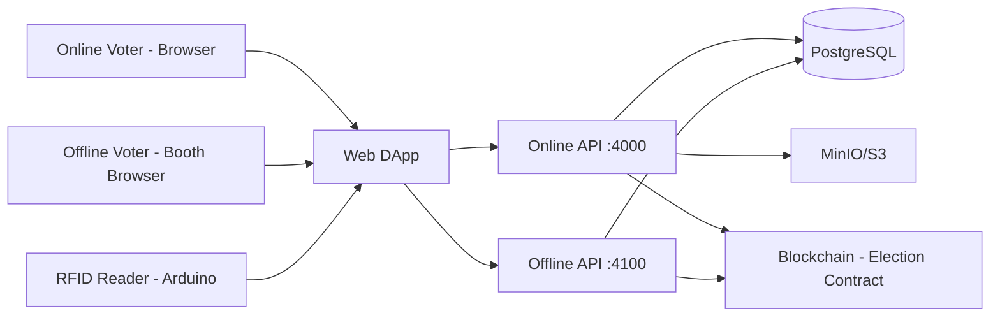

# System Study - Online + Offline Election System Using Blockchain

This document summarizes the active VoteHybrid baseline.

## 1) Background

- Traditional voting is slow, costly, and can be error-prone.
- Online voting improves convenience but requires strong integrity controls.
- A hybrid model combines online access with RFID-assisted offline booths while keeping final vote integrity on-chain.

## 2) Problem Definition

- Centralized-only systems can be hard to audit.
- Pure online flows can face trust and verification concerns.
- A practical system must prevent duplicate voting while preserving privacy.

## 3) Objectives

- Provide secure online and offline voting paths.
- Keep vote integrity and anti-duplication logic on-chain.
- Keep sensitive identity data off-chain.

## 4) Key Features

- One voter, one on-chain vote (`hasVoted` enforced).
- Shared voter identity between online and offline systems (same user + same wallet).
- Offline booth flow with RFID card login and voter PIN confirmation.
- Audit logs for offline booth actions.

## 5) High-Level Architecture

## 6) System Requirements

### Software

- Solidity smart contract + Foundry tests
- React + TypeScript DApp
- Online API (`services/api`)
- Offline API (`v2/services/offline-api`)

### Hardware

- Arduino + RC522 RFID reader
- Polling-booth browser (Chrome/Edge for Web Serial)

### Functional

- Online registration/login and KYC approval flow
- RFID link to user profile for offline voting
- Offline login by RFID scan, candidate selection, and PIN confirmation
- Vote submission from both paths into the same smart contract

### Non-Functional

- Real-time scanner response in booth flow
- Privacy: no raw KYC documents on-chain
- Auditability via on-chain state + offline audit events

## 7) Data Handling and Privacy

- On-chain: candidate/voter status and vote results.
- Off-chain: user profile, KYC metadata, RFID hash mapping, PIN hash, audit logs.
- Wallet private keys are encrypted at rest.

## 8) Risks and Mitigations

- Double voting: blocked by on-chain `hasVoted` checks.
- Unauthorized voting: KYC + wallet readiness + PIN checks.
- RFID reuse: unique RFID binding per user in offline profile.
- PIN abuse: attempt limits + temporary lockout.

## 9) Documentation in DApp

The DApp includes `/docs` page and proposal PDF:

- DApp route: `/docs`
- PDF asset: `apps/dapp/public/docs/votehybrid-project-proposal.pdf`
- Source proposal: `project.pdf`

cd "c:\Users\ashutosh shah\Desktop\Projects\ash\voting-system-master (3)\voting-system-master\v2\device\serial-bridge"
npm.cmd run dev -- --port COM3 --mode session --api "http://localhost:4100" --baud 115200 --timeoutMs 15000 --retries 1

npm.cmd --prefix ".\v2\device\serial-bridge" run dev -- --port COM3 --mode session --api "http://localhost:4100" --baud 115200 --timeoutMs 15000 --retries 1
