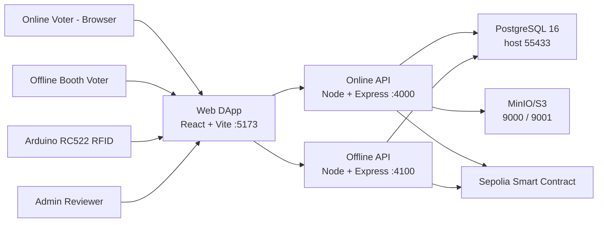

# System Architecture

Last updated: 2026-03-11

Active VoteHybrid architecture (online + offline RFID).

Core technologies:
- Frontend: React 19, Vite 7, TypeScript 5.9, React Router 7, Tailwind CSS 3.4, ethers 6
- Online API: Express 5, Prisma 6, Zod 4, JWT, Multer, AWS SDK S3, ethers 6
- Offline API: Express 5, Prisma 6, Zod 4, JWT, bcryptjs, ethers 6
- Contract toolchain: Solidity 0.8.20 + Foundry
- Infra: Docker Compose, PostgreSQL 16, MinIO
- Device path: Arduino RC522 + Web Serial, with optional Node serial bridge for diagnostics

Local endpoints:
- DApp: `http://localhost:5173`
- Online API: `http://localhost:4000`
- Offline API: `http://localhost:4100`
- PostgreSQL host port: `55433`
- MinIO API / Console: `9000` / `9001`

Notes:
- Online and offline flows use the same user and wallet model.
- Duplicate voting is prevented on-chain (`hasVoted`) and checked by both APIs.
- Offline booth flow is RFID + PIN; officer attestation endpoint remains only for legacy compatibility.
- See `technology-stack.md` for the current versioned stack summary.
