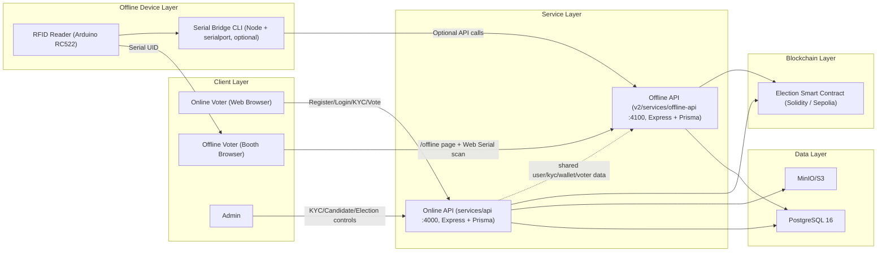
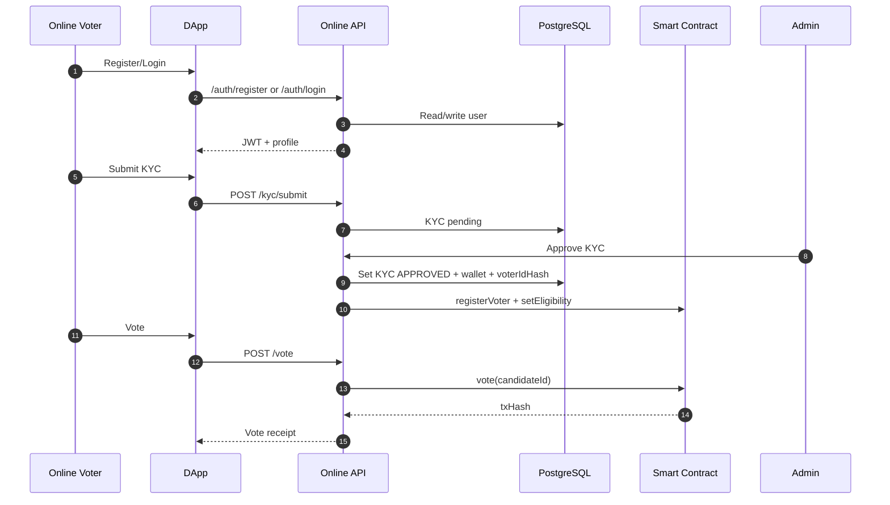
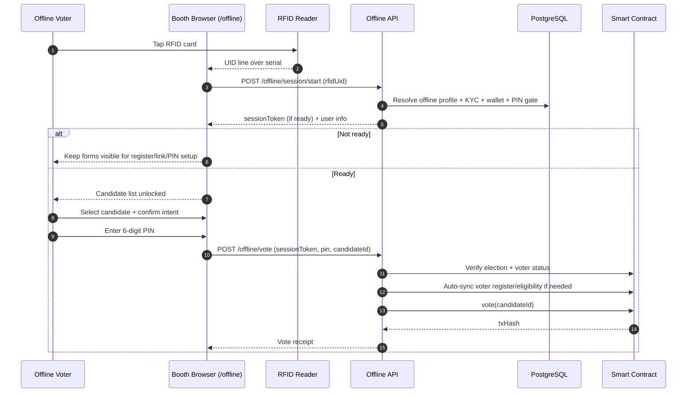

# Deep System Workflow

Last updated: 2026-03-11

This document describes the active VoteHybrid workflow for both online and offline voting.

## 0) Technology Map

| Layer | Technologies in use | Notes |
| --- | --- | --- |
| Browser UI | React 19, Vite 7, TypeScript 5.9, React Router 7, Tailwind CSS 3.4 | Main user/admin interface and booth page |
| Online service | Node.js, Express 5, Prisma 6, Zod 4, JWT, Multer, AWS SDK S3, ethers 6 | Registration, login, KYC, admin workflows, online voting |
| Offline service | Node.js, Express 5, Prisma 6, Zod 4, JWT, bcryptjs, ethers 6 | RFID linking, PIN handling, offline voting, audit trail |
| Contract layer | Solidity 0.8.20, Foundry, Sepolia | Election state, vote status, candidate/result storage |
| Data layer | PostgreSQL 16, MinIO | Shared DB plus S3-compatible object storage |
| Device layer | Arduino RC522, Web Serial API, optional Node serial bridge (`serialport`) | Browser flow is primary; CLI bridge is optional |

Local runtime ports:
- Frontend: `5173`
- Online API: `4000`
- Offline API: `4100`
- Postgres host: `55433`
- MinIO API / console: `9000` / `9001`

## 1) Deep Architecture Diagram

## 2) Online Voting Sequence

## 3) Offline Voting Sequence (Active Web Flow)

## 4) Offline Gate Conditions

`/offline/session/start` checks:
- `pinReady`
- `kycApproved`
- `walletReady`

If any gate is false, session token is not usable for voting and UI keeps setup path visible.

## 5) Duplicate Vote Prevention (Online vs Offline)

- Online API blocks when on-chain `hasVoted = true`.
- Offline API also checks on-chain `hasVoted` before submit.
- Smart contract enforces final `Already voted` protection.

Result: if user votes online first, offline vote for same wallet is rejected.

## 6) Legacy Compatibility Notes

- `POST /offline/session/attest` is kept for backward compatibility.
- Officer step is disabled in active simplified flow.
- Serial bridge remains optional for diagnostics/automation; booth UI uses Web Serial directly.
- See `technology-stack.md` for the concise versioned technology summary.
